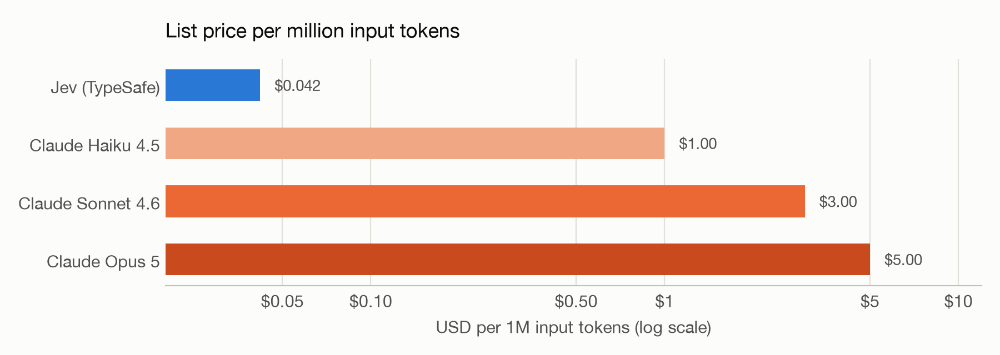
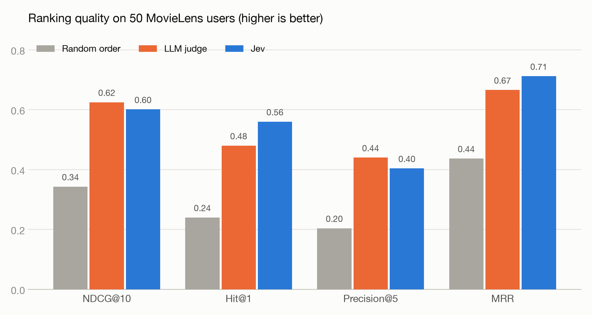
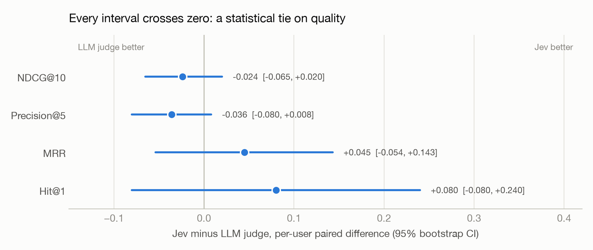
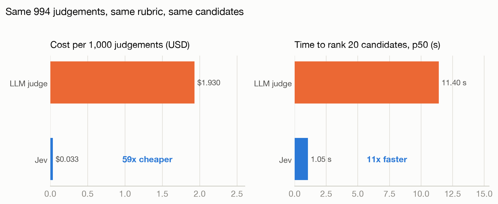

# I swapped the LLM judge in a movie recommender for a $0.04 model. Quality held, and the bill dropped 59x.

*A reproducible test of TypeSafe AI's Jev as a reranker, against Claude as a judge, on real MovieLens users.*

---

Most LLM products have a step where the model is asked to grade something. Rank these candidates. Pick the best of five drafts. Decide whether this answer violates a rule. That step is usually done by calling the same large language model again with a "you are a strict judge" prompt, parsing its answer, and hoping it was consistent.

It works, but it is slow and it is expensive, and the model gives you a number with no honest sense of how sure it is.

I wanted to know whether a model built specifically for that grading step could do the job. So I built a small movie recommender, put the grading step behind an interface, and ran the same evaluation against three implementations: a purpose-built scoring model called Jev, a Claude model acting as judge, and random order as a floor.

This article walks through what Jev is, how the recommender uses it, how the evaluation works, and what the numbers say. Everything is open: the code, the protocol, the raw results.

## What Jev is

Jev is the first model from TypeSafe AI. They call it a "System One" model, after the fast, intuitive mode of thinking in Kahneman's *Thinking, Fast and Slow*. The name is a good summary of the design. Jev does not generate text. It does not chat. You give it a block of text they call the *state*, and you ask it typed questions about that text. It returns typed answers.

There are three question types:

- **Score.** You give an ordered list of levels, for example five sentences from "clearly a poor match" to "near-perfect match". Jev returns a probability for each level, plus a confidence.
- **Choice.** You give a set of labeled options. Jev returns the chosen label, a confidence, and the probability of each option.
- **Noul.** You give a single statement. Jev returns the probability that the statement holds for the state, as a number between 0 and 1.

The interesting word in that description is *probability*. A text LLM asked "rate this 0 to 4" writes a digit. Jev returns a distribution over the levels, and TypeSafe claims that distribution is calibrated. Calibrated means that when the model says 70 percent, it is right about 70 percent of the time. That is a very different thing from a digit.

The other interesting number is the price. Jev is listed at $0.042 per million input tokens. A token is roughly three quarters of a word. For comparison, Claude Haiku 4.5, the cheapest current Claude model, lists at $1.00 per million input tokens. Claude Sonnet 4.6, the model I used as the judge, is $3.00.

A model that only answers typed questions, cannot write prose, and costs 70 times less than the cheapest general model. The question is whether it can hold its own on a real grading task.

## The recommender

The product is deliberately simple. You type a request in plain language, something like "something like Arrival but lighter, no horror". You get back five movies, each with a one-sentence explanation.

Under the hood it runs five steps:

1. **Taste profile.** An LLM reads the request and extracts a structured profile: liked titles, genres, themes, tone, era, and a list of things to avoid.
2. **Candidates.** The LLM proposes fifteen real movies that might fit the profile.
3. **Verification.** Every proposed title is looked up in The Movie Database (TMDB). Titles that do not exist are dropped. LLMs invent movies more often than you would think, and no scoring model can grade a film that is not real.
4. **Rerank.** Each verified movie is scored against the profile and the list is reordered. This is the step under test.
5. **Explanations.** The LLM writes one sentence for each of the top five.

The rerank step is behind a small interface with one method: given a profile and a list of movies, return a verdict per movie. Three implementations exist and can be switched with an environment variable.

**Jev.** One request per movie. The state is the profile plus the movie's title, year, genres and synopsis, about 300 tokens. Three questions: a Score on a five-level fit scale, a Choice for the main reason it matches (tone, themes, genre, style or era), and a Noul asking whether the movie violates one of the profile's exclusions.

**LLM judge.** The same three questions, the same five-level scale, the same reason labels, sent as a prompt to Claude Sonnet 4.6. It returns a JSON object with a single fit level, a reason, and a boolean for violation.

**None.** Keeps the order the candidates came in. This is the baseline that tells you whether reranking does anything at all.

The rubric text is defined once and shared by both real rerankers. If the LLM judge saw a different question than Jev, any difference in results could be blamed on the prompt. Both see the same words.

## How the score is computed

This is the part where Jev's design pays off, so it is worth being precise.

The LLM judge returns a single level, say 3 on a scale of 0 to 4. That becomes a fit score of 0.75 and there is nothing more to extract.

Jev returns a probability for each of the five levels. Suppose it says level 3 with probability 0.5 and level 4 with probability 0.5. Taking the most likely level would give 3 or 4, a coin flip. Instead, the recommender takes the *expected value*: the average level weighted by probability, which here is 3.5, or a fit score of 0.875. Two movies that both "most likely" sit at level 3 are now distinguishable by how much probability mass leans toward level 4 versus level 2.

The final score for each movie is the expected fit multiplied by one minus the violation probability from the Noul question. A movie that Jev is 90 percent sure breaks the "no horror" rule loses 90 percent of its score. No hard threshold, no manual rule.

Jev also returns a confidence for each answer. The recommender does not use it to filter. It uses it to break ties and to flag results as low confidence so a user interface can label them. Whether to hide low-confidence results is a product decision, and it stays a configuration knob.

## The evaluation

The question was: given the same candidates and the same profile, which reranker puts the movies the user actually liked closer to the top?

To answer that with real people rather than my own taste, I used MovieLens, the standard public dataset of movie ratings. The small version has 610 users and about 100,000 ratings, each with a timestamp.

For each user the protocol is:

1. Sort their ratings by time. Take the last five movies they rated 4 stars or higher. These are the *held-out positives*: movies we know the user liked, hidden from the system.
2. Build a plain-text request from their earlier ratings only, in the shape a real user would type: "I loved: Toy Story, Heat, The Usual Suspects. I did not enjoy: Batman Forever." Run it through the same profile-extraction step the product uses.
3. Mix the five held-out positives with fifteen popular movies the user never rated. Shuffle. Fetch the TMDB card for each of the twenty.
4. Let each reranker order the same twenty movies against the same profile.
5. Measure how high the five positives landed.

Fifty users, a fixed random seed so the run is reproducible, and every LLM output cached on disk so reruns only pay for Jev.

Why not let the LLM propose candidates the way the product does, and check whether it guessed the held-out movies? Because fifteen guesses almost never overlap with five specific titles, for any reranker. That protocol would measure the candidate generator. Fixing the candidate set isolates the component Jev is meant to replace.

### The metrics

Four numbers, all between 0 and 1, all higher-is-better.

- **NDCG@10.** Normalized Discounted Cumulative Gain over the top ten. It rewards putting positives high and penalizes them more the further down they sit. A perfect ordering scores 1. This is the standard ranking metric.
- **Hit@1.** Is the very first movie one the user liked? Averaged over users, it is the probability the top recommendation is a hit.
- **Precision@5.** What fraction of the top five are positives? With five positives among twenty, the ceiling is 1.0 and random order lands near 0.25.
- **MRR.** Mean Reciprocal Rank. One divided by the position of the first positive. Rewards getting *a* hit near the top.

## Results

Both real rerankers are far above random on every metric. Reranking does something, and both models know what a good match looks like.

Between the two, the picture splits. The LLM judge scores higher on NDCG@10 and Precision@5, the two metrics that reward getting the whole list right. Jev scores higher on Hit@1 and MRR, the two that reward getting the top spot right. Jev's top recommendation was a hit for 56 percent of users. The LLM judge's was a hit for 48 percent.

Are those differences real? With 50 users, the honest answer requires a paired test. For each user, I computed Jev's score minus the LLM judge's score, then bootstrapped a 95 percent confidence interval on the mean difference. If the interval contains zero, the data cannot tell the two apart.

Every interval contains zero. On quality, the two rerankers are a statistical tie. The LLM judge won more individual users on NDCG@10 (32 to 15) and Jev won more on Hit@1 (10 to 6, with 34 ties), so if either has a real edge, it is the LLM judge on list depth and Jev on the top slot. Neither edge is large enough to show up with this sample size.

Now the other two axes.

Both rerankers made 994 judgements, one per movie per user. The LLM judge cost $1.92. Jev cost $0.033. That is 59 times cheaper, and that ratio prices Jev's output tokens at zero because TypeSafe has not published an output price. At any plausible output rate the ratio stays above 50.

Time to rank one user's twenty candidates was 11.4 seconds at the median for the LLM judge and 1.05 seconds for Jev. Part of that gap is parallelism: the recommender runs eight Jev calls at once and four LLM calls at once, because LLM rate limits make wider concurrency expensive. Per individual call, Jev was about six times faster.

## What this means

For the grading step in this pipeline, Jev delivers the same ranking quality as a frontier LLM judge at roughly one sixtieth of the cost and one tenth of the wall-clock time.

That changes what you can afford to do. At $0.033 per thousand judgements, scoring twenty candidates per request is not something to budget for. You can score sixty. You can generate three candidate lists and let Jev pick the strongest set. You can rescore the whole catalog slice every time the profile changes. None of that is reasonable at $1.92 per thousand.

The calibrated distribution is the part I expected to matter and the part this experiment exercised least. The expected-value scoring is in use, and it is why two movies at the same most-likely level still get different scores. But only 0.3 percent of Jev's verdicts fell below the low-confidence threshold, and the violation question rarely fired, because profiles built from star ratings almost never contain a "no horror" clause. A protocol that tests whether Jev's 70 percent really means 70 percent is the next experiment.

There is also a structural point in Jev's favour that the numbers do not show. The LLM judge produces a level, a label and a boolean by writing JSON, and that JSON has to be parsed. During this run, the LLM occasionally wrote a paragraph where a label was expected, or ran past its token limit mid-object. Each of those had to be caught and handled. Jev returns typed fields with bounded values. There is nothing to parse and nothing to hope for.

## Caveats, stated plainly

- Fifty users, one seed, one LLM. Differences under about 0.05 in NDCG are inside the noise, and the noise is what the confidence intervals show.
- The negatives are popular movies, not hard ones. A negative set drawn from the same genres as the positives would separate the rerankers more and could change the ordering.
- Profiles come from rating summaries, not from real free-text requests.
- The LLM judge's confidence is 1.0 by construction, so tie-breaking on confidence can only help Jev. That is a deliberate design choice, and it is a small structural advantage in MRR.
- Jev's SDK was a week old when I wrote this. I called the HTTP endpoint directly with a small client and validated every response against the documented shape.

## The bottom line

If you have an LLM-as-judge step that grades candidates against a fixed rubric, you are probably paying frontier prices for a task a much smaller, purpose-built model can do just as well. In this test, Jev matched Claude Sonnet 4.6 on ranking quality, beat it on the top recommendation, and did it 59 times cheaper and 11 times faster.

The code, the evaluation protocol, and the raw per-user results are in the repository. The whole experiment reruns with one command and about two dollars of LLM credit.

**Code and results:** [github.com/SebasPinto/moviejev](https://github.com/SebasPinto/moviejev)

*Jev is in early access from TypeSafe AI. I have no affiliation with them; I asked for a key and ran the numbers.*
